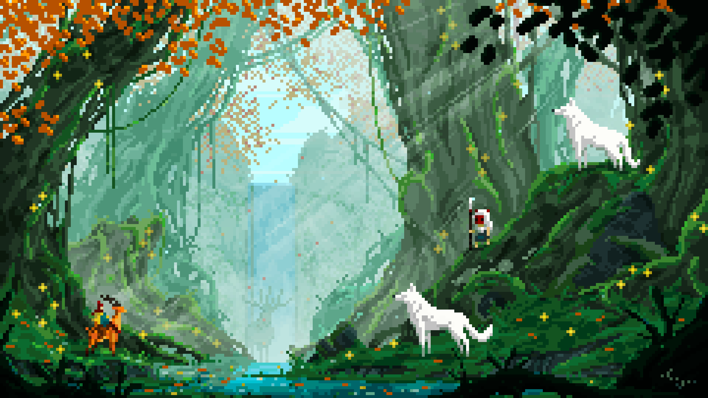
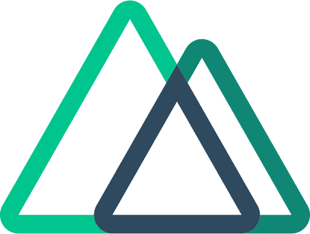

### Всем привет! Меня зовут Мария ✨

 

И я фронтенд разработчик. 🤠 Мои цели:
 - создавать удобные и красивые интерфейсы для пользователей, 
 - научиться улучшать производительность в проектах,
 - освоить новые для меня технологии и укрепить знания уже приобретенных,
 - найти опытную команду (нет обучения без челленджа)

## 👀 Мой стек:

  
  
  
  
  
  
  
  
  
  
  
  

 

## Мои контакты
 [GitLab account](https://gitlab.com/Rimriru)
 
      <danilovafrontdev@gmail.com>
 
      [@mariafrontdev](https://t.me/mariafrontdev)
 
       [My LinkedIn Profile](https://www.linkedin.com/in/danilova-maria/)

## 🗿 Моя статистика:

 
 

 

